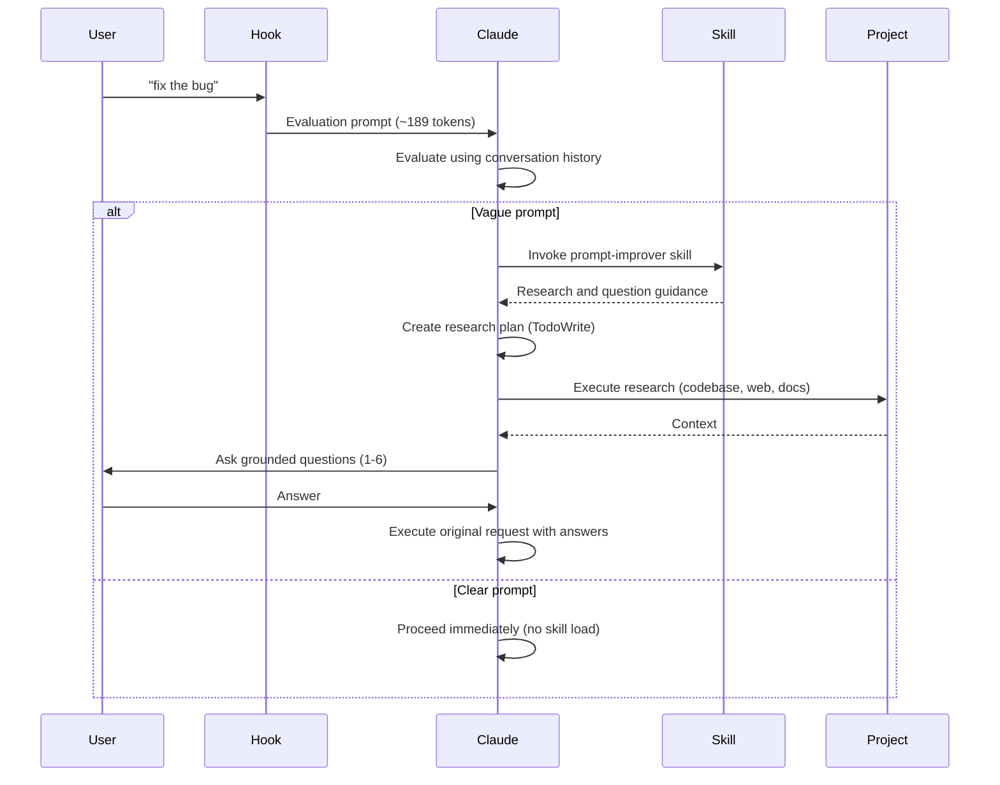

---
scout_metadata:
  discovered_at: "2026-03-25T12:31:20Z"
  source: github_search
  query_matched: "claude code hook"
  quality_score: 75
  scoring_breakdown:
    stars: 27
    recency: 15
    docs: 20
    community: 13
github_data:
  full_name: "severity1/claude-code-prompt-improver"
  url: "https://github.com/severity1/claude-code-prompt-improver"
  description: "Intelligent prompt improver hook for Claude Code. Type vibes, ship precision."
  stars: 1308
  forks: 112
  open_issues: 10
  language: "Python"
  license: "MIT"
  last_push: "2026-02-14"
  created: "2025-10-18"
  topics: []
---

# severity1/claude-code-prompt-improver

> Discovered by arsenal scout — awaiting manual triage

## Description

Intelligent prompt improver hook for Claude Code. Type vibes, ship precision.

## README Excerpt

# Claude Code Prompt Improver

A UserPromptSubmit hook that enriches vague prompts before Claude Code executes them. Uses the AskUserQuestion tool (Claude Code 2.0.22+) for targeted clarifying questions.


## What It Does

Intercepts prompts and evaluates clarity. Claude then:
- Checks if the prompt is clear using conversation history
- For clear prompts: proceeds immediately (zero overhead)
- For vague prompts: invokes the `prompt-improver` skill to create research plan, gather context, and ask 1-6 grounded questions
- Proceeds with original request using the clarification

**Result:** Better outcomes on the first try, without back-and-forth.

**v0.4.0 Update:** Skill-based architecture with hook-level evaluation achieves 31% token reduction. Clear prompts have zero skill overhead, vague prompts get comprehensive research and questioning via the skill.

## How It Works



## Installation

**Requirements:** Claude Code 2.0.22+ (uses AskUserQuestion tool for targeted clarifying questions)

### Option 1: Via Marketplace (Recommended)

**1. Add the marketplace:**
```bash
claude plugin marketplace add severity1/severity1-marketplace
```

**2. Install the plugin:**
```bash
claude plugin install prompt-improver@severity1-marketplace
```

**3. Restart Claude Code**

Verify installation with `/plugin` command. You should see the prompt-improver plugin listed.

### Option 2: Local Plugin Installation (Recommended for Development)

**1. Clone the repository:**
```bash
git clone https://github.com/severity1/claude-code-prompt-improver.git
cd claude-code-prompt-improver
```

**2. Add the local marketplace:**
```bash
claude plugin marketplace add /absolute/path/to/claude-code-prompt-improver/.dev-marketplace/.claude-plugin/marketplace.json
```

Replace `/absolute/path/to/` with the actual path where you cloned the repository.

**3. Install the plugin:**
```bash
claude plugin install prompt-improver@local-dev
```

**4. Restart Claude Code**

Verify installation with `/plugin` command. You should see "1 plugin available, 1 already installed".

### Option 3: Manual Installation

**1. Copy the hook:**
```bash
cp scripts/improve-prompt.py ~/.claude/h

## Links

- Repository: https://github.com/severity1/claude-code-prompt-improver
